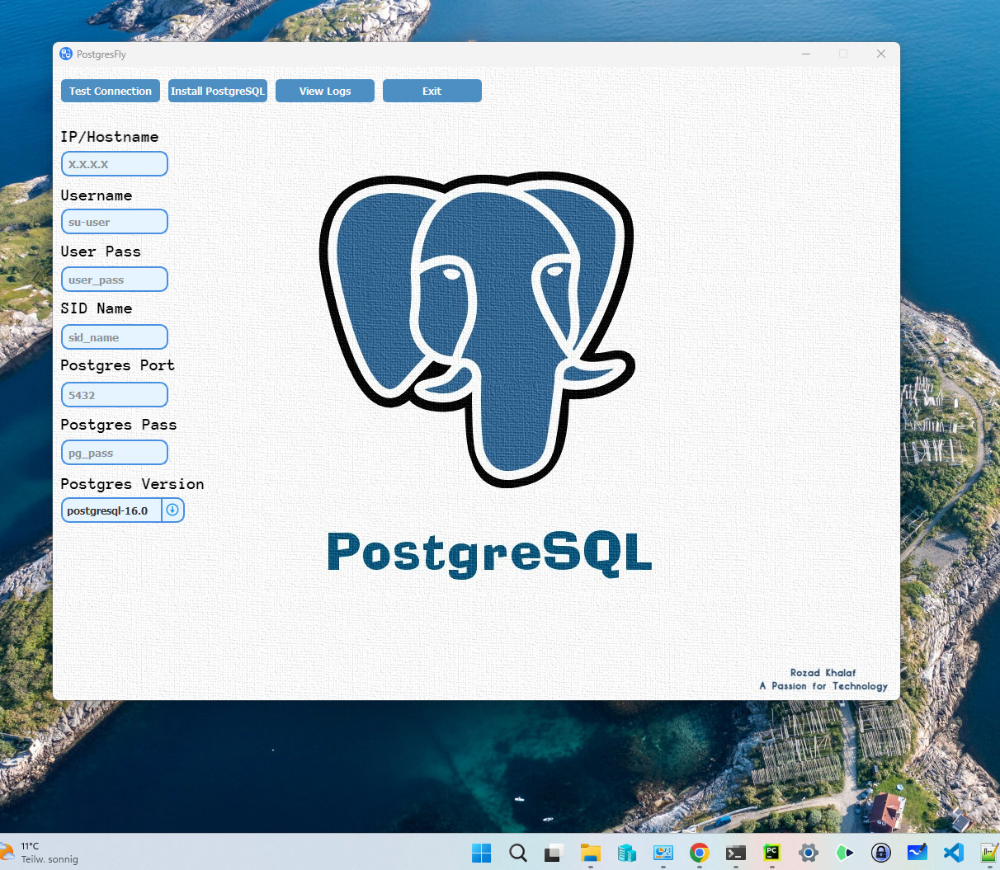

# PostgresFly
A streamlined tool for remotely installing PostgreSQL on Linux machines using a Windows interface. Fly through your setup with PostgresFly!

**PostgresFly** is an efficient tool designed for Windows users to remotely install various versions of PostgreSQL on Linux machines. Following the installation of PostgreSQL, PostgresFly provides a backup script to facilitate regular backups of your PostgreSQL database. With its user-friendly interface, PostgresFly allows for the installation of the desired PostgreSQL version on a Linux server with just a few inputs and a single click.

## Operating System:
- The tool is developed for Windows and facilitates the installation of various PostgreSQL versions on a Linux machine via a remote connection.

# Prerequisites

## User Permissions on the Linux Machine:
- The executing user must have `sudo` permissions.
- In `/etc/sudoers`, the entry `Username ALL=(ALL) NOPASSWD:ALL` should be present. Replace "Username" with the actual username.

## Directory Structure on the Linux Machine:
- A `pg-data` directory should be present in the root directory where PostgreSQL data will be stored.
  ```bash
  sudo mkdir /pg-data

## Required Software on Linux Machines:
- **SSH** for remote connection:
  ```bash
  sudo apt install openssh-server

- **PowerShell** for backup tasks using the provided script:
  ```bash
  sudo apt-get update
  sudo apt-get install -y wget apt-transport-https software-properties-common
  source /etc/os-release
  wget -q https://packages.microsoft.com/config/ubuntu/$VERSION_ID/packages-microsoft-prod.deb
  sudo dpkg -i packages-microsoft-prod.deb
  rm packages-microsoft-prod.deb
  sudo apt-get update
  sudo apt-get install -y powershell

## Download

You can download PostgresFly by clicking on the following link:
[**PostgresFly Download**](https://drive.google.com/file/d/1GMMbYRwVmDJ-rB0PosJRTzRswls2xR9o/view?usp=drive_link)

## Starting the Application

1. Download and extract the `PostgresFly.zip` file from GitHub.
2. Navigate to the extracted folder.
3. It is recommended to run `PostgresFly.exe` as an administrator to ensure that the program has the necessary permissions. Right-click `PostgresFly.exe` and select "Run as administrator" from the context menu.


## User Interface & Functionalities



- **IP/Hostname**: Enter the IP address or DNS name of the Linux machine.
- **Username & User Pass**: Credentials of the user on the Linux machine who will perform the installation.
- **SID-Name**: Name of the PostgreSQL instance.
- **Postgres Pass**: Password for the "postgres" user on the Linux machine. Note: This is not a database user.
- **PostgreSQL-Port**: Default is 5432. If using a different port, enter it in the provided field, otherwise use the default port 5432.
- **PostgreSQL-Version**: Select the desired version from the dropdown list.

### Test Connection
Tests the connection to the Linux machine.

### Install PostgreSQL
Initiates the installation of the selected PostgreSQL version.

### View Logs
Displays the installation logs.

### Exit
Closes the tool.

## Workflow

1. **Enter Information**: Fill in all the required fields.
2. **Select Actions**: For example, "Test Connection" or "Start Installation".
3. **Receive Installation Feedback**: A message box will notify about the success or failure of the action.
4. **Check Logs if Needed**: Useful in case of errors or to monitor the process.

## Monitoring Installation Progress

As the installation proceeds, the progress bar in the GUI will indicate the status of the installation. It ranges from 0% (beginning of the installation) to 100% (installation complete). Ensure that you wait for the progress bar to reach 100% before proceeding with other tasks or closing the application.

## After the Installation
Once the PostgreSQL installation is complete, you'll need to start the specific PostgreSQL instance on the Linux VM. The service name follows the format pg-sidname.service, where "sidname" is the name of the PostgreSQL instance you provided:
 ```bash
sudo systemctl start pg-sidname.service

To verify that the specific PostgreSQL instance has started successfully, you can check the service status with the following command:
```bash
sudo systemctl status pg-sidname.service

If the service has started correctly, the status will display as active (running).

## Troubleshooting

### Connection Errors
- Verify the IP, username, and password.
- Ensure that the SSH service is installed on the Linux machine.

### Installation Issues
- Review the logs to diagnose any issues.
- Ensure all prerequisites are met.

### UI Issues
- Restart the program.

